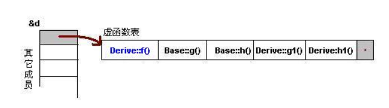
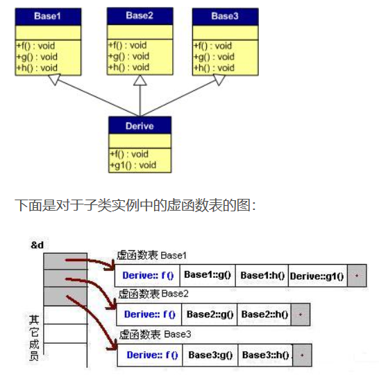
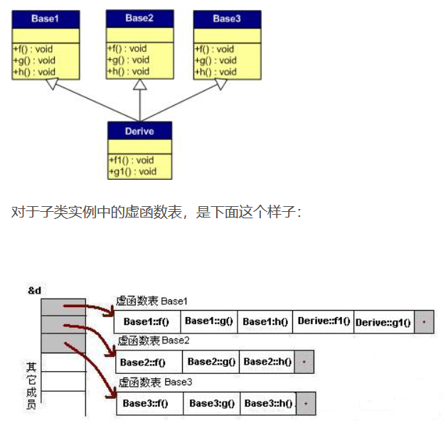

### 如果TCP连接第三次握手时候的ack没有被server接收到会怎么样 
> * 由于TCP连接的重传机制,server会继续发送SYN+ACK包,以便client继续发送ack
> * 如果server端一直未收到client的ACK,则当client发送数据包时,server会发送RST包表示连接未能成功建立.

### HTTP和HTTPS的区别:
一个是明文一个是加密传输.
* 加密就涉及到公钥和私钥的概念,用户把公钥都存储在CA中,然后自己留存私钥,
* 进行数据传输时,从CA获取对方的公钥用对方的公钥进行加密
* 对方收到数据之后,用自己留存的私钥进行解密.
* HTTPM明文传输的话,被抓包窃取数据的风险就十分大.

**这种非对称加密通常用于连接建立阶段,连接建立之后双方协商一个对称加密key,根据该key进行加密传输.**
**(这我明明学的啊,为什么一面试我就想不起来了呢,是不是太紧张了啊哈哈哈)**

### 一张20M大小的图片,如果显示在200*200的范围内,需要占据多少内存

### 虚函数是如何实现的
> 虚函数是通过虚函数表进行实现的.这个表主要是一个虚函数地址表.在内存中被分配在了实例的内存中.(如果实例有虚函数的话.)而实例的**内存地址的开头就存了虚函数指针指向虚函数表**,如果有多个继承,则有多个指针放在内存地址的开头.
> **如果有虚函数重载**,
> **如果无虚函数重载**,
> **多继承有重载**,
> **多继承无重载**,,

### 只有2000个INT的内存,怎么排序10000个数据,数据都是从1-10000
> 用位进行排序.用300多个整数的内存空间进行位标记,数字i出现过则把第i位置1,如果一个数字会出现多次,则针对1-10000的10000个数,每个数都用14位空间进行标记出现的次数.总共需要...(好像多次出现空间超出了哈哈.如果出现的次数限定几次一下还是有可能通过2000个INT空间排序的.)

### NETTY跟C++有什么关系

### 负数取余的结果

### 什么时候会用多线程什么时候会用多进程.
> IO比较多的时候用多线程.当并行计算比较多的时候,用多进程.
> 进程崩溃时,不会影响其它进程.而线程崩溃时,会导致整个进程崩溃以至于其他线程都无法运行.