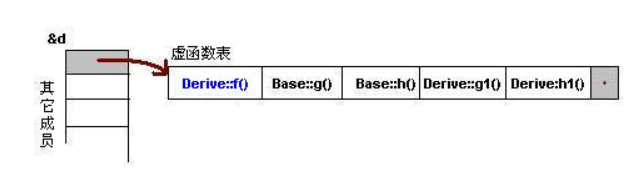
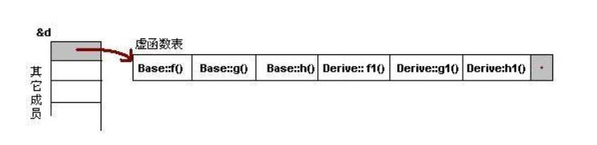
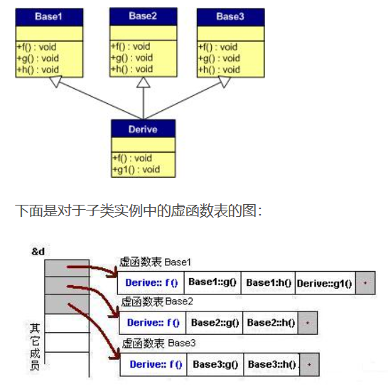
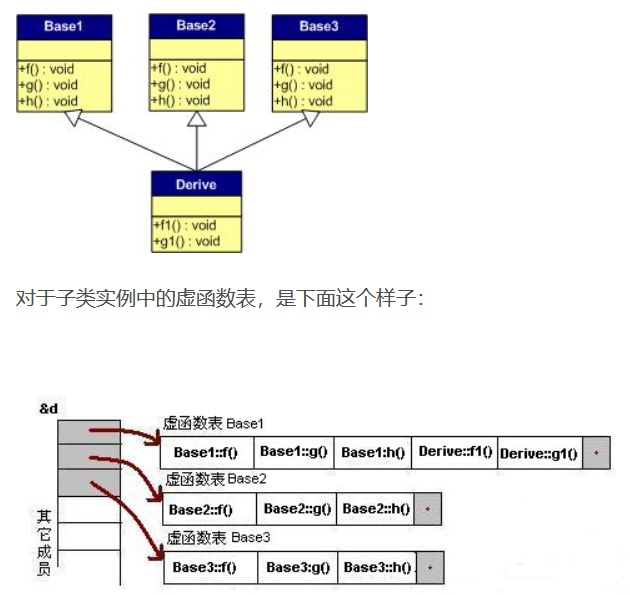

## 如果TCP连接第三次握手时候的ack没有被server接收到会怎么样 
> * 由于TCP连接的重传机制,server会继续发送SYN+ACK包,以便client继续发送ack
> * 如果server端一直未收到client的ACK,则当client发送数据包时,server会发送RST包表示连接未能成功建立.


## HTTP和HTTPS的区别:
一个是明文一个是加密传输.
* 加密就涉及到公钥和私钥的概念,用户把公钥都存储在CA中,然后自己留存私钥,
* 进行数据传输时,从CA获取对方的公钥用对方的公钥进行加密
* 对方收到数据之后,用自己留存的私钥进行解密.
* HTTPM明文传输的话,被抓包窃取数据的风险就十分大.

**这种非对称加密通常用于连接建立阶段,连接建立之后双方协商一个对称加密key,根据该key进行加密传输.**
**(这我明明学的啊,为什么一面试我就想不起来了呢,是不是太紧张了啊哈哈哈)**

## 一张20M大小的图片,如果显示在200*200的范围内,需要占据多少内存

## 虚函数是如何实现的
> 虚函数是通过虚函数表进行实现的.这个表主要是一个虚函数地址表.在内存中被分配在了实例的内存中.(如果实例有虚函数的话.)而实例的**内存地址的开头就存了虚函数指针指向虚函数表**,如果有多个继承,则有多个指针放在内存地址的开头.
> **如果有虚函数重载**,
> **如果无虚函数重载**,
> **多继承有重载**,
> **多继承无重载**,,


## 只有2000个INT的内存,怎么排序10000个数据,数据都是从1-10000
> 用位进行排序.用300多个整数的内存空间进行位标记,数字i出现过则把第i位置1,如果一个数字会出现多次,则针对1-10000的10000个数,每个数都用14位空间进行标记出现的次数.总共需要...(好像多次出现空间超出了哈哈.如果出现的次数限定几次一下还是有可能通过2000个INT空间排序的.)


## NETTY跟C++有什么关系


## 负数取余的结果


## 什么时候会用多线程什么时候会用多进程.
> IO比较多的时候用多线程.当并行计算比较多的时候,用多进程.
> 进程崩溃时,不会影响其它进程.而线程崩溃时,会导致整个进程崩溃以至于其他线程都无法运行.

## 红黑树的结构,以及红黑树在哪里会用到
> 节点分为红黑两种颜色,规定:**根节点为红**,并且**相邻两个节点不能为红**,且**对于某个子树的根节点来说,左右子树的黑节点不能为另一颗子树的两倍**
> 红黑树在`stl`库中`map`和`set`中都有被用到(有序`map`和`set`)

## 宏定义中,'#'和'##'的用法
> `##`在宏中定义，是字符连接符如`a##b##c` 等同于 `"abc"`
`#`在宏开头出现，是表示宏展开的方式不同
`#`a 等同于`"a"`

## c++中静多态和动多态
> * **静多态**:主要是运算符重载和函数重载,**动多态**主要是虚函数.


## 进程和线程有哪些是共享的哪些是不共享的
> 进程中的堆归所有线程共享.线程的栈是不共享的.**堆用来保存其运行状态和局部自动变量的。**,因此**栈是thread safe的**,堆在**使用完需要资源释放,不然会造成内存泄漏**
> 共享部分|非共享部分
> ---|:--:
> 地址空间|程序计数器
> 全局变量|寄存器
> 打开的文件|栈
> 子进程|状态字
> 定时器|
> 信号及信号处理程序|
> 记账信息|


## 进程和线程的概念有什么不同
**根本区别:**
> 进程是资源分配最小单位，线程是程序执行的最小单位。 计算机在执行程序时，会为程序创建相应的进程，进行资源分配时，是以进程为单位进行相应的分配。每个进程都有相应的线程，在执行程序时，实际上是执行相应的一系列线程。

**地址空间:**
> 进程有自己独立的地址空间，每启动一个进程，系统都会为其分配地址空间，建立数据表来维护代码段、堆栈段和数据段；线程没有独立的地址空间，同一进程的线程共享本进程的地址空间。

**资源拥有:**
> 进程之间的资源是独立的；同一进程内的线程共享本进程的资源。

**执行过程：**
> 每个独立的进程程有一个程序运行的入口、顺序执行序列和程序入口。但是线程不能独立执行，必须依存在应用程序中，由应用程序提供多个线程执行控制。

## 进程间如何通信:
> * 管道`pipe`只能在父子进程之间流动
> * 消息队列
> * 信号量
> * 共享内存
> * `FIFO`命名管道:可以在无亲缘关系进程间通信.
> * 信号
> * 套接字`socket`


## 给定N个数,如果找出前k小的数.
> 就是`bfprt`算法,然后又返回去看左神的教学视频,真的是如沐春风..但是当时脑子打结了,也可能是题目做多了思维被限制住了,第一时间想到的就是用最大堆最小堆,然后建立了之后弹出k次堆顶元素,就得到了前k元素
> 其实也可以用荷兰国旗算法,小于某个值放左边,等于某个值放中间,大于某个值放右边,然后看等于的值的范围中有没有k,如果k在等于的值的最小下标左边,继续对左边执行荷兰国旗算法,直到等于某个值的范围中有k,就可以输出前k个元素.
> *脑子不灵清哈哈,既然都用排序算法排序了,那为什么不直接用快排呢哈哈* *其实是因为我快排不会写,嘘!*


## HTTP状态码的含义:
状态码（Status-Code）
```C
1xx：表示通知信息，如请求收到了或正在进行处理
    100 Continue：继续，客户端应继续其请求
    101 Switching Protocols 切换协议。服务器根据客户端的请求切换协议。只能切换到更高级的协议，例如，切换到 HTTP 的新版本协议
2xx：表示成功，如接收或知道了
    200 OK: 请求成功
3xx：表示重定向，如要完成请求还必须采取进一步的行动
    301 Moved Permanently: 永久移动。请求的资源已被永久的移动到新 URL，返回信息会包括新的 URL，浏览器会自动定向到新 URL。今后任何新的请求都应使用新的 URL 代替
4xx：表示客户的差错，如请求中有错误的语法或不能完成
    400 Bad Request: 客户端请求的语法错误，服务器无法理解
    401 Unauthorized: 请求要求用户的身份认证
    403 Forbidden: 服务器理解请求客户端的请求，但是拒绝执行此请求（权限不够）
    404 Not Found: 服务器无法根据客户端的请求找到资源（网页）。通过此代码，网站设计人员可设置 “您所请求的资源无法找到” 的个性页面
    408 Request Timeout: 服务器等待客户端发送的请求时间过长，超时
5xx：表示服务器的差错，如服务器失效无法完成请求
    500 Internal Server Error: 服务器内部错误，无法完成请求
    503 Service Unavailable: 由于超载或系统维护，服务器暂时的无法处理客户端的请求。延时的长度可包含在服务器的 Retry-After 头信息中
    504 Gateway Timeout: 充当网关或代理的服务器，未及时从远端服务器获取请求
```
## sizeof(struct)的大小
**涉及到字节对齐的概念**
答案是字节对齐，计算机存储系统中以Byte为单位存储数据，不同数据类型所占的空间不同，如：整型（int）数据占4个字节，字符型（char）数据占一个字节，短整型（short）数据占两个字节，等等。计算机为了快速的读写数据，默认情况下将数据存放在某个地址的起始位置，如：整型数据（int）默认存储 在地址能被4整除的起始位置，字符型数据（char）可以存放在任何地址位置（被1整除），短整型（short）数据存储在地址能被2整除的起始位置。**这样字节对齐有助于加快计算机的取数速度，否则就得多花指令周期了。**具体为啥那就是编译原理的知识了
字节对齐的细节和具体编译器实现相关，但一般而言，满足三个准则：
1. 结构体变量的首地址能够被其最宽基本类型成员的大小所整除；
2. 结构体每个成员相对于结构体首地址的偏移量都是当前成员大小的整数倍，如有需要编译器会在成员之间加上填充字节；
3. 结构体的总大小为结构体最宽基本类型成员大小的整数倍，如有需要编译器会在最末一个成员之后加上填充字节。
主要是因为计算机CPU访问数据的效率问题,例如一个整形变量的地址.比如为0x00000002，则CPU如果取它的值的话需要访问两次内存，第一次取从0x00000002-0x00000003的一个short，第二次取从0x00000004-0x00000005的一个short然后组合得到所要的数据，如果变量在0x00000003地址上的话则要访问三次内存，第一次为char，第二次为short，第三次为char，然后组合得到整型数据。而如果变量在自然对齐位置上，则只要一次就可以取出数据。

## 一致性哈希
普通哈希算法需要对机群数量进行取模,而一致性哈希采用的就是原来的哈希值,因此不用对原来的数据重新取模,而是将宕机的部分往后移动至第一台服务器,或者是新加的服务器从后面的服务器截取对应部分的数据.
(怎么说呢,就是取消了取模这一环节,导致服务器增加或者减少的时候不用再重新计算哈希值.)


## long long[10000][10000]按行读取和按列读取有什么不同
缓存从内存中抓取一般都是整个数据块，所以它的物理内存是连续的，几乎都是同行不同列的，而如果内循环以列的方式进行遍历的话，将会使整个缓存块无法被利用，而不得不从内存中读取数据，而从内存读取速度是远远小于从缓存中读取数据

## gcc常用参数
> * `-E:`只预处理 ，不会编译，汇编，链接
>* `-S:`只编译，不会编译，汇编，链接
>* `-I directory:`指定 `include` 包含文件的搜索目录
>* `-O:`提高编译优化级别
> `-O0:`关闭所有优化选项
> `-O1:`基本优化，编译器会生成更快的代码
> `-O2:`-O1的升级版，推荐使用
> `-O3:`这是目前最高的优化级别，它会使用更多的编译时间
> `-Os:`这个级别是用来优化代码尺寸的,适合给一些**CPU缓存或者磁盘小**的机器使用.
>* `-C`在预处理的时候, 不删除注释信息, 一般和-E使用, 有时候分析程序，
>* `-M`生成文件关联的信息。包含目标文件所依赖的所有源代码你可以用`gcc -M hello.c`来测试一下，很简单。
>* `-llibrary`制定编译的时候使用的库
>* `-static`

**代码编译过程复习一下**

    1、预处理,生成 .i 的文件[预处理器cpp]
    2、将预处理后的文件转换成汇编语言, 生成文件 .s [编译器egcs]
    3、用汇编变为目标代码(机器代码)生成 .o 的文件[汇编器as]
    4、连接目标代码, 生成可执行程序 [链接器ld] 

## 进程死锁的产生于防止
1. 互斥条件
2. 不剥夺
3. 请求和保持
4. 循环等待条件
* 死锁避免:
> 系统对进程发出的每一个系统能够满足的资源申请进行动态检查，并根据检查结果决定是否分配资源，如果分配后系统可能发生死锁，则不予分配，否则予以分配，这是一种保证系统不进入死锁状态的动态策略。
> 1. **破坏“不可剥夺”条件：** 一个进程不能获得所需要的全部资源时便处于等待状态，等待期间他占有的资源将被隐式的释放重新加入到 系统的资源列表中，可以被其他的进程使用，而等待的进程只有重新获得自己原有的资源以及新申请的资源才可以重新启动，执行。
> 2. **破坏”请求与保持条件“：** 第一种方法静态分配即每个进程在开始执行时就申请他所需要的全部资源。第二种是动态分配即每个进程在申请所需要的资源时他本身不占用系统资源。
> 3. **破坏“循环等待”条件：** 采用资源有序分配其基本思想是将系统中的所有资源顺序编号，将紧缺的，稀少的采用较大的编号，在申请资源时必须按照编号的顺序进行，一个进程只有获得较小编号的进程才能申请较大编号的进程。
## B+树和B树除了空间利用之外还有什么区别
1. b+树的中间节点不保存数据，所以磁盘页能容纳更多节点元素，更“矮胖”；
2. b+树查询必须查找到叶子节点，b树只要匹配到即可不用管元素位置，因此b+树查找更稳定（并不慢）；
3. 对于范围查找来说，b+树只需遍历叶子节点链表即可，b树却需要重复地中序遍历，如下两图：
## 25匹马选出最快3匹
1. 每5匹一组五组进行比赛
假设结果为:  
```C
1  2  3  4  5
6  7  8  9  10
11 12 13 14 15
16 17 18 19 20
21 22 23 24 25
```
显然,每组的最后两名是不可能为前三的即:
```C
1  2  3 
6  7  8 
11 12 13
16 17 18
21 22 23
```
2. 第六场,每一组的第一名进行比较,假设结果为:`11 6 16 1 21`,则显然`1,21`及之后的马不可能成为前三,并且`16`之后的是不可能成为前三的,因为`16`之前已经有两批了,同理,`11`之后的`13`也是不可能成为前三的,因为`11`之前已经有一匹了,
```C
6  7  8 
11 12 
16 
```
此时,`11`显然是最快的,只需要把剩下5匹再跑一次即可.